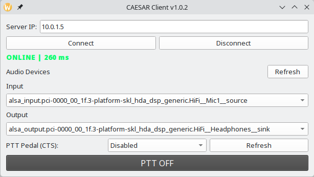

# CAESAR Desktop Client

Desktop client for the [CAESAR radio communication system](https://github.com/ra0sms/caesar_project).  
Transmits and receives audio over UDP using the Opus codec via GStreamer, with PTT (Push-to-Talk) control via network or foot pedal.



---

## Server

This client connects to the **CAESAR Server** — a hardware/software device based on a single-board computer that handles audio routing and PTT control.

👉 [github.com/ra0sms/caesar_project](https://github.com/ra0sms/caesar_project)

---

## Features

- Half-duplex audio over UDP (Opus / RTP)
- PTT via on-screen button or foot pedal (CTS signal via COM port)
- Server availability monitoring with ping display
- Configurable audio input/output devices
- Cross-platform: **Linux** and **Windows**

---

## Download

Ready-to-use binaries are available on the [Releases page](https://github.com/ra0sms/caesar-client-desktop/releases):

| Platform | File |
|---|---|
| Linux x86_64 | `CAESAR_Desktop_vX.X.X_-x86_64.AppImage` |
| Windows x86_64 | `CAESAR_Desktop_vX.X.X_windows_x86_64.exe` |

---

## Requirements

### Linux

| Dependency | Purpose |
|---|---|
| Python 3.10+ | Runtime |
| PyQt5 | GUI |
| GStreamer 1.x + plugins | Audio pipeline |
| PulseAudio (`pactl`) | Audio device enumeration |
| pyserial | Foot pedal (COM port) |

Install GStreamer plugins (Fedora/RHEL):
```bash
sudo dnf install gstreamer1 gstreamer1-plugins-base \
     gstreamer1-plugins-good gstreamer1-plugins-bad-free \
     gstreamer1-plugin-opus
```

Install GStreamer plugins (Ubuntu/Debian):
```bash
sudo apt install gstreamer1.0-tools gstreamer1.0-plugins-base \
     gstreamer1.0-plugins-good gstreamer1.0-plugins-bad \
     gstreamer1.0-plugins-ugly
```

### Windows

| Dependency | Purpose |
|---|---|
| Python 3.10+ | Runtime |
| PyQt5 | GUI |
| GStreamer 1.x (MSVC build) | Audio pipeline |
| pyserial | Foot pedal (COM port) |

Install GStreamer from the official site: https://gstreamer.freedesktop.org/download/  
Choose the **MSVC 64-bit** runtime and development installer.  
Make sure `C:\gstreamer\1.0\msvc_x86_64\bin` is added to `PATH`.

> **Note:** On Windows, audio uses the system default input/output devices (WASAPI). Per-device selection is not yet supported.

---

## Installation

```bash
git clone https://github.com/ra0sms/caesar-client-desktop.git
cd caesar-client-desktop

python -m venv venv

# Linux
source venv/bin/activate

# Windows
venv\Scripts\activate

pip install -r requirements.txt
```

---

## Running

```bash
python main.py
```

---

## Building

### Linux — AppImage

```bash
bash build_appimage.sh
```

Output: `Releases/CAESAR_Desktop_vX.X.X_-x86_64.AppImage`

`linuxdeploy` is downloaded automatically on first build.

### Windows — EXE

```bat
build_windows.bat
```

Output: `Releases\CAESAR_Desktop_vX.X.X_windows_x86_64.exe`

---

## Configuration

Settings are saved automatically to:

| Platform | Path |
|---|---|
| Linux | `~/.caesar-desktop/config.json` |
| Windows | `C:\Users\<user>\.caesar-desktop\config.json` |


Add virtual Audio device for WSJT integration
```bash
pactl load-module module-null-sink sink_name=WSJT_SINK
```
To use this device for WSJT, set the `audio_output` in your config to `WSJT_SINK`.

---

## Network Ports

| Port | Protocol | Purpose |
|---|---|---|
| 5000 | UDP | Audio stream (RTP/Opus) |
| 5001 | UDP | PTT control |
| 5002 | UDP | Server ping / monitoring |

---

## Project Structure

```
├── main.py                 # Entry point
├── config.py               # Load/save settings
├── footswitch.py           # Foot pedal (CTS via serial)
├── serial_ports.py         # Serial port enumeration
├── version.txt             # Current version (source of truth)
├── changelog.txt           # Release history
├── build_appimage.sh       # Linux build script
├── build_windows.bat       # Windows build script
├── audio/
│   ├── backend.py          # Cross-platform GStreamer abstraction
│   ├── rx.py               # Audio receive (UDP → speaker)
│   ├── tx.py               # Audio transmit (mic → UDP)
│   └── devices.py          # Device enumeration (delegates to backend)
├── network/
│   ├── ptt.py              # PTT UDP client
│   ├── ping.py             # Ping utility
│   ├── ping_server.py      # Ping responder
│   └── server_monitor.py   # Connection status monitor
├── gui/
│   └── main_window.py      # Main application window
├── screenshots/
│   └── main_window.png     # screenshot for README
└── tools/                  # auto-created on first build (not in git)
    └── linuxdeploy-x86_64.AppImage
```

---

## Changelog

See [changelog.txt](changelog.txt).

---

## License

MIT
